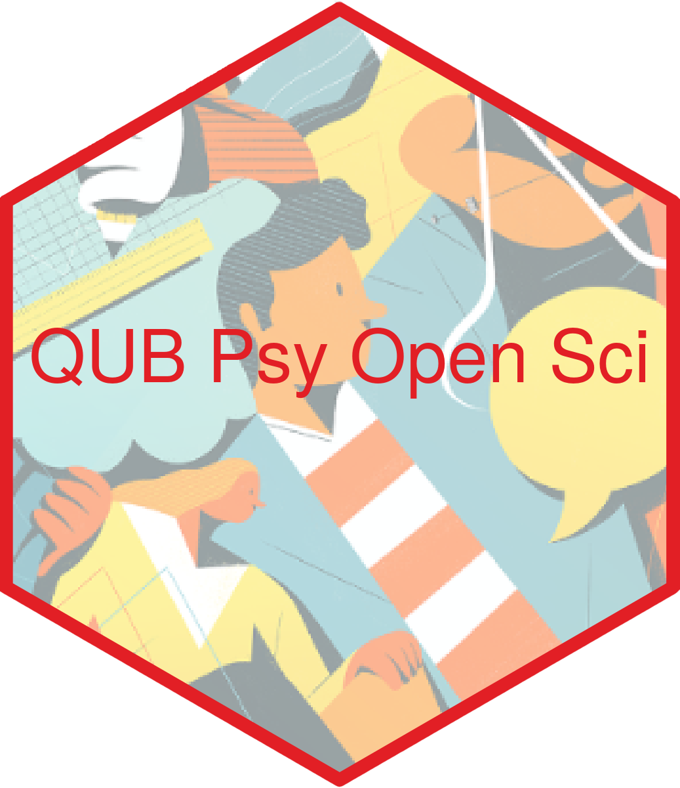

--- 
title: "Queen's University Belfast, School of Psychology, Open Science Group"
author: "Joost Dessing, Gary McKeown, Gillian Shorter, Matthew Rodger, Paul Toner, Lisa Graham-Wisener" 
date: "`r Sys.Date()`"
site: bookdown::bookdown_site
documentclass: book
bibliography: [book.bib, packages.bib]
# url: your book url like https://bookdown.org/yihui/bookdown
# cover-image: path to the social sharing image like images/cover.jpg
description: |
  This is a minimal example of using the bookdown package to write a book.
  The HTML output format for this example is bookdown::gitbook,
  set in the _output.yml file.
link-citations: yes
github-repo: rstudio/bookdown-demo
---

# Background

This is a bookdown website intended to whole the developing documentation from the Open Science Group in the School of Psychology at Queen's University Belfast. It is a live and working document and will be updated as more materials become available.

Figure. \@ref(fig:Figure1)

```{r Figure1, echo=FALSE, fig.align='center', fig.cap="QUB Psy Open Sci Hex", fig.asp = 0.7, fig.width = 6, out.width = '30%'}

```

# Princples

## Kindness 

These Open Science guidelines are written as an accessible guide to Open Science for academic and research staff in the School of Psychology, Queen’s University Belfast. However, they should also be helpful for professional service staff and students. In the spirit of Open Science, the guidelines are available for all including those from outside the institution. The following guide is a living document which will be continually updated to keep the information aligned with advances in Open Science, so it is best to refer to the most current version of the guidelines.  

## Equity and Diversity 

Open Science emphasises transparency and integrity in accurate and truthful reporting of science. Being open and transparent at all stages and all levels of the scientific process improves all scientific fields. The principles and proposed practices of Open Science serve to expand the accessibility and inclusivity of research and the knowledge it creates. By making data, analysis methods, and other research materials available to all through online repositories, many of the barriers to participation in science for those outside of elite academic institutions are removed. In this sense, Open Science principles are aligned to enhancing equity in science and expanding the diversity of future research as a result. 

## Why is Open Science important? 

Open Science directly addresses the ‘replication crisis’ initially identified in the field of Psychology. This is where scientists were previously incentivised by the academic publishing system to report ‘false positive’ results which failed to replicate. In contrast, Open Science is a mindset to do what is right for science. There is increasing recognition of the value of Open Science practices which are being embedded within criteria, including but not limited to 1) open access publishing in high impact journals, 2) research funding, especially by national and international funders 3) the Research Excellent Framework, 4) academic job descriptions and progression 5) Higher Education teaching curricula.         

## Open Science Practices 

To help embed Open Science within the research culture of the School of Psychology, this guide will provide descriptions and practical advice on key Open Science practices. Section 1 will... 
